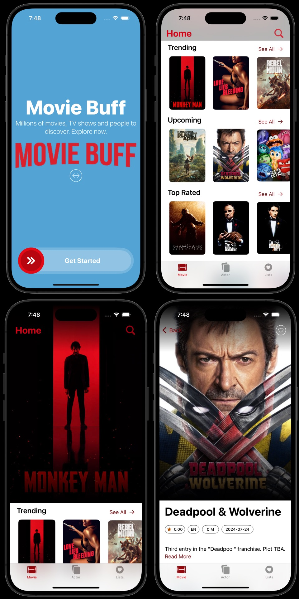
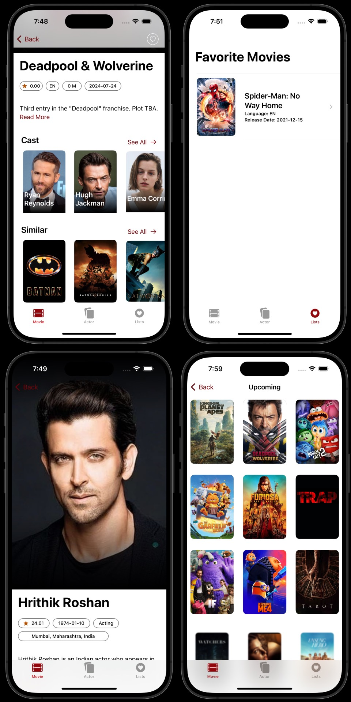

# Movie Buff
Discover millions of movies, TV shows and actors. Explore now. Get review, rating.
Get Trending, Upcoming, All time hits, Hollywood, Bollywood movies. Search for movies, create a list of your favorite movies and much more.

## Screenshots

## Using Movie Buff
* Requires Xcode 15 running macOS Sonoma or macOS Ventura
* Clone repo on your Mac
* Navigate to Movie_Buff/App
* Create a new file called tmdb-info.plist
* Go to [TMDB Api](https://developer.themoviedb.org/reference/intro/getting-started)
* Sign-In or create an account
* Generate an API Key
* Open project in Xcode
* Edit tmdb-info.plist
* Add key value pair. Key is Authorization and value of type string is your API Key from [TMDB](https://developer.themoviedb.org/reference/intro/getting-started)
* Select iPhone simulator
* Build and Run

## Built With
* [SwiftUI](https://developer.apple.com/tutorials/swiftui) - SwiftUI is a modern way to declare user interfaces for any Apple platform. Create beautiful, dynamic apps faster than ever before.
* [UIKit](https://developer.apple.com/documentation/uikit) - Construct and manage a graphical, event-driven user interface for your iOS, iPadOS, or tvOS app.
* [SwiftData](https://developer.apple.com/documentation/swiftdata) - Write your model code declaratively to add managed persistence and automatic iCloud sync.
* [Concurrency](https://developer.apple.com/documentation/swift/concurrency) - Perform asynchronous and parallel operations, using Task, Async, Await, Actors.
* [AVFoundation](https://developer.apple.com/av-foundation/) - AVFoundation is the full featured framework for working with time-based audiovisual media on iOS, macOS, watchOS and tvOS.
* [TMDB Api](https://developer.themoviedb.org/reference/intro/getting-started) - This is where you will find the definitive list of currently available methods for our movie, tv, actor and image API.

## Views
* Onboarding Screen
* Movie List
* Actor List
* Favorite Movie List
* Movie Detail View
* Actor Detail View

## Upcoming Features
* TV Shows
* Search Actors
* To Watch List

## Contributors
* Mohak Tamhane - [mohak92](https://github.com/mohak92)